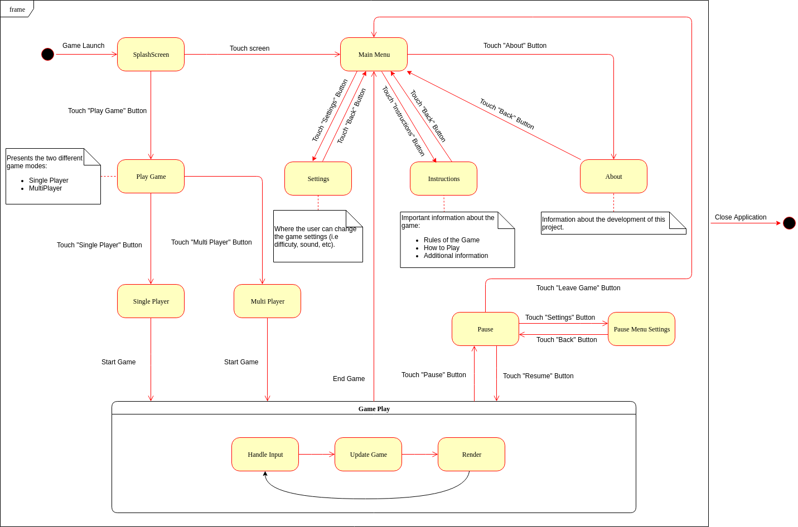

# Intermediate Check-Point

## UML
### Package and Class Diagram

### State Diagram

## Design Patterns

Note: As we have already started coding and separating the project by concerns, we have selected the following design patterns which we think that fit the objective of this game.

- Composite

  The UI outside the game is composed by menus which themselves may be composed by other menus. The user may navigate between a menu and its childs in a linear direction, so each menu should also know its parent, and according to the user input, change the current screen accordingly.
  
- Singleton

  The game will have a single asset manager, that should be available throught the duration of the game. Therefore, it can be a singleton.
  There will also only ever be one game, thus the main class, AirHockeyMania, should be a singleton.
  
- Model-View-Controller

  Our game has several models (menu buttons, puck, handles), views (menu screens, the game screen), and an interface that allows the user to change the state of the game
    - which view is currently shown
    - where the objects are located
    - what the objects' data (speed, etc) are
  Therefore, the models are represented by Actors, the views by Screens, and the controllers by input controllers and Stages.
  

## GUI Design

### Main functionalities
The GUI can be divided in two parts, in and off game.
Off game state is represented by the menu's, which may include the following:

- Main Menu
  - New Game
    - SinglePlayer
    - MultiPlayer
  - Settings
    - Sound
    - SP Settings
    - SP Costumization
  - About
  
In game, the user will have access to the current score, and a pause option (only in singleplayer mode, in multiplayer this feature may be added but requires both users to press the button in order for it to work) that may allow the user to forfeit, or change the game's options, such like puck speed or bounciness.

### Mock ups

Note: The following images only try to show what features the GUI may have, not what it may look like. The final GUI may very well be different, these are just ideas.

## Test Design

- Menu Navigation tests: The purpose of this tests is to check whether or not the buttons do their expected behaviour (i.e. upon touching the Settings Button, the user should be redirected to the Settings Menu).

- Test Settings: These tests check if the changes in the game settings are applied to the game (i.e. if the user changes the difficulty
from easy to hard, the game should be harder to win).

- Test Movements: Test in-game movements of our objects according to their attributes (i.e. check if the puck moves upwards when it has a positive linear velocity in the y axis).

- Test Collisions: Check if the objects collide with each other.

- Test Score/ End Game: Check if the score updates when a player scores a goal and if the game ends (win or loss) when a player reaches the max score. 
